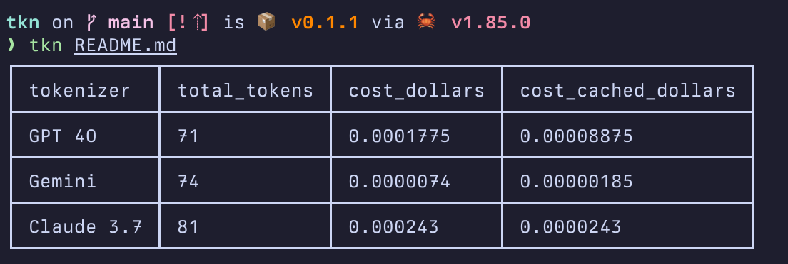

# TKN

CLI for calculating tokens and costs



## Installation

```shell
cargo install tkn-cli
```

## Usage

Method 1: calculate tokens for a plain text file

```shell
tkn foo.txt
```

Method 2: calculate tokens from stdin

```shell
cat foo.txt | tkn
```
